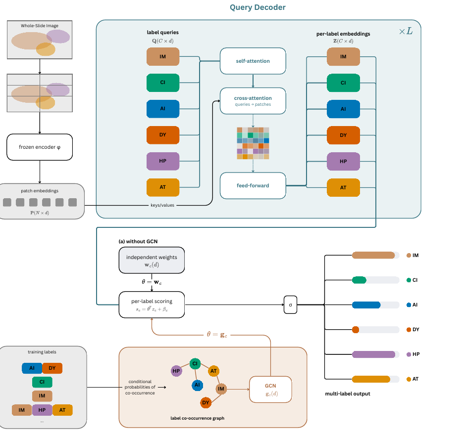

<div align="center">

# QLabelMIL

### Inter-Pathology Query Decoding for Multi-Label Gastric Histopathology

**Pedro C. Neto**<sup>1,3,\*</sup> · **Rita N. Lopes**<sup>3,\*</sup> · **Lígia Prado e Castro**<sup>2</sup>

<sup>1</sup> Unilabs.AI, Campus Biotech, Geneva, Switzerland · <sup>2</sup> Unilabs, Campus Biotech, Geneva, Switzerland
<sup>3</sup> Faculdade de Engenharia da Universidade do Porto (FEUP), Portugal · <sup>\*</sup> Equal contribution

**MICCAI 2026 · COMPAYL Workshop**

[](https://papers.miccai.org/miccai-2026-sat/paper/COMPAYL_060.pdf) <!-- TODO: link to paper / arXiv -->

</div>

---

## TL;DR

Gastric cancer precursors (*H. pylori* infection, atrophy, intestinal metaplasia) co-occur along the **Correa cascade**, but most whole-slide image (WSI) classifiers train one aggregator per condition or share a single slide embedding. **QLabelMIL** is a multiple-instance learning (MIL) aggregator that:

- uses **one learnable query per pathology** and a **transformer decoder** to model patch-to-label relationships;
- supports **joint multi-label classification** in a single model;
- produces **per-class attention heatmaps** natively;
- optionally uses a **Graph Convolutional Network (GCN)** over the label co-occurrence prior to couple the per-label classifiers.

Evaluated on **5,764 WSIs from 3,412 patients** against ABMIL, CLAM, ACMIL, TransMIL and MambaMIL, QLabelMIL reaches a **macro-AUROC of up to 0.9186** with competitive calibration.

<p align="center">
  
</p>

<p align="center"><em>Figure 1. A frozen encoder produces patch embeddings used as keys and values. Label queries undergo self-attention (inter-label relationships) and cross-attention with the patches (per-label features Z). The head scores each label with (a) independent weights or (b) GCN-derived weights from the label co-occurrence graph.</em></p>

---

## Table of contents

- [Method](#method)
- [Results](#results)
- [Installation](#installation)
- [Data preparation](#data-preparation)
- [Training](#training)
- [Evaluation](#evaluation)
- [Per-class heatmaps](#per-class-heatmaps)
- [Repository structure](#repository-structure)
- [Data availability](#data-availability)
- [Citation](#citation)
- [Acknowledgements](#acknowledgements)
- [License](#license)

---

## Method

### 1. Shared query decoder

A frozen encoder gives patch features $H \in \mathbb{R}^{N \times d_e}$. They are projected and normalised into patch tokens, and $C$ learnable label queries $E$ are refined by $L$ decoder layers:

$$P = \mathrm{LN}(H W_p) \in \mathbb{R}^{N \times d}, \qquad Q^{(0)} = E \in \mathbb{R}^{C \times d}$$

$$Q' = Q^{(\ell-1)} + \mathrm{MHA}\big(\mathrm{LN}\,Q^{(\ell-1)}, \mathrm{LN}\,Q^{(\ell-1)}, \mathrm{LN}\,Q^{(\ell-1)}\big)$$

$$Q'' = Q' + \mathrm{MHA}\big(\mathrm{LN}\,Q', P, P\big)$$

$$Q^{(\ell)} = Q'' + \mathrm{FFN}\big(\mathrm{LN}\,Q''\big)$$

The output is $Z = \mathrm{LN}(Q^{(L)}) = [z_1, \dots, z_C]^\top$, where $z_c$ is the slide representation for pathology $c$.

- **Self-attention** is computed among the $C$ queries and captures inter-label relationships.
- **Cross-attention** has queries from the labels and keys/values from the patches. Its $C \times N$ attention matrix gives the per-class heatmaps, at cost $O(C \cdot N)$ rather than the $O(N^2)$ of patch-to-patch attention.

### 2. Classification head

**QLabelMIL (independent).** Each label has its own weight vector:

$$s_c = w_c^\top z_c + \beta_c, \qquad \hat p_c = \sigma(s_c)$$

**QLabelMIL (GCN).** The weights come from a GCN over a label co-occurrence graph built from the training labels:

$$M_{cc'} = \sum_n y_c^{(n)} y_{c'}^{(n)}, \qquad P_{cc'} = \frac{M_{cc'}}{M_{c'c'}} = \Pr(c \mid c')$$

An edge links $c$ and $c'$ when $P_{cc'} \ge \tau$. Each label keeps weight $1-p$ on itself and shares $p$ uniformly among its neighbours:

$$\hat A_{cc'} = \begin{cases} \dfrac{p}{\sum_{k \neq c} \mathbb{1}[P_{ck} \ge \tau]} & c \neq c',\ P_{cc'} \ge \tau \\[2mm] 1-p & c = c' \\ 0 & \text{otherwise} \end{cases}$$

$$G^{(\ell)} = \delta\big(\hat A\, G^{(\ell-1)}\, \Theta^{(\ell)}\big), \qquad [g_1, \dots, g_C]^\top = G^{(L_g)}, \qquad s_c = g_c^\top z_c + \beta_c$$

### 3. Loss

Both variants minimise binary cross-entropy averaged over labels, with a positive weight per class equal to the negative/positive ratio of the training split:

$$\mathcal{L} = \frac{1}{C} \sum_{c} \mathrm{BCE}(\hat p_c, y_c)$$

### How QLabelMIL compares

| Mechanism | ABMIL | CLAM | ACMIL | MambaMIL | TransMIL | **QLabelMIL** |
|---|:-:|:-:|:-:|:-:|:-:|:-:|
| Per-class attention maps | ✗ | ✓ | ✗ | ✗ | ✗ | ✓ |
| Class co-occurrence modelling | ✗ | ✗ | ✗ | ✗ | ✗ | ✓ |
| Label-relationship graph | ✗ | ✗ | ✗ | ✗ | ✗ | ✓ |
| Single multi-label model by design | ✗ | ✗ | ✗ | ✗ | ✗ | ✓ |

<sub>Rows reflect the claims in the paper's Table 1 as discussed in its related-work section. Please verify against the final published table before release.</sub>

---

## Results

### Dataset

5,764 H&E WSIs from 3,412 patients all scanned at the same facility. Slide-level labels were extracted from clinical reports. The split is by patient: 70% train, 15% validation, 15% test. Tissue was segmented with Otsu thresholding and tiled into non-overlapping 40× patches, with concentric 10× patches. Features were extracted at both magnifications with frozen ResNet18 and ResNet50 backbones.

| Condition | Positives | Used for training |
|---|--:|:-:|
| Intestinal metaplasia (IM) | 1,372 | ✓ |
| *H. pylori* (HP) | 2,145 | ✓ |
| Atrophy (AT) | 1,838 | ✓ |
| Chronic inflammation (CI) | 4,882 | ✗ (no representative negatives) |
| Acute inflammation (AI) | 32 | ✗ (too few positives) |
| Dysplasia (DY) | 11 | ✗ (too few positives) |

Models are trained on IM, HP and AT. Additional 6-class experiments gave similar outcomes and are not reported in the paper.

### Diagnostic performance (test AUROC ↑)

R18 / R50 = ResNet18 / ResNet50 features. **Bold** = best, *italic* = second best in each column.

| Pathology | Model | 10× R18 | 10× R50 | 40× R18 | 40× R50 |
|---|---|:-:|:-:|:-:|:-:|
| **IM** | ABMIL | 0.9352 | 0.9356 | 0.9326 | 0.9433 |
| | CLAM | *0.9356* | 0.9377 | *0.9456* | 0.9528 |
| | ACMIL | 0.9269 | 0.9380 | **0.9489** | 0.9513 |
| | MambaMIL | 0.9327 | *0.9469* | 0.9453 | *0.9570* |
| | TransMIL | 0.9289 | 0.9377 | 0.9448 | 0.9495 |
| | **QLabelMIL** | **0.9427** | **0.9496** | *0.9456* | **0.9604** |
| | QLabelMIL (GCN) | 0.9342 | 0.9459 | 0.9430 | 0.9543 |
| **HP** | ABMIL | 0.8986 | 0.8969 | 0.9079 | 0.9051 |
| | CLAM | *0.9126* | 0.9149 | 0.9148 | 0.9120 |
| | ACMIL | 0.9088 | **0.9236** | 0.9018 | 0.9038 |
| | MambaMIL | 0.9008 | 0.9120 | 0.9034 | 0.9112 |
| | TransMIL | 0.9067 | 0.9179 | 0.9049 | 0.9114 |
| | **QLabelMIL** | 0.9082 | *0.9204* | *0.9163* | *0.9157* |
| | QLabelMIL (GCN) | **0.9147** | 0.9117 | **0.9194** | **0.9204** |
| **AT** | ABMIL | **0.8714** | 0.8654 | 0.8575 | 0.8660 |
| | CLAM | 0.8601 | 0.8618 | 0.8560 | 0.8677 |
| | ACMIL | 0.8498 | 0.8727 | 0.8600 | 0.8612 |
| | MambaMIL | 0.8563 | 0.8730 | 0.8453 | *0.8714* |
| | TransMIL | 0.8606 | *0.8827* | *0.8627* | **0.8735** |
| | **QLabelMIL** | *0.8643* | **0.8857** | **0.8632** | 0.8684 |
| | QLabelMIL (GCN) | 0.8642 | 0.8721 | 0.8595 | 0.8711 |
| **Macro avg.** | ABMIL | 0.9017 | 0.8993 | 0.8993 | 0.9048 |
| | CLAM | 0.9028 | 0.9048 | 0.9055 | 0.9108 |
| | ACMIL | 0.8952 | 0.9114 | 0.9036 | 0.9054 |
| | MambaMIL | 0.8966 | 0.9107 | 0.8980 | 0.9132 |
| | TransMIL | 0.8987 | *0.9128* | 0.9041 | 0.9115 |
| | **QLabelMIL** | **0.9051** | **0.9186** | **0.9083** | *0.9148* |
| | QLabelMIL (GCN) | *0.9044* | 0.9099 | *0.9073* | **0.9153** |

**Takeaways**

- A QLabelMIL variant is first in 12 of the 16 AUROC columns, including all four macro-average settings.
- Best macro-AUROC is **0.9186** (10×, ResNet50), +0.0058 over the strongest baseline (TransMIL).
- The independent variant has the best overall diagnostic performance. The GCN helps most for *H. pylori*, where it is first in three of four settings.
- IM is the easiest target and atrophy the hardest. ResNet50 generally beats ResNet18. Atrophy prefers 10×, IM and *H. pylori* prefer 40×.

### Calibration (macro-ECE ↓)

| Model | 10× R18 | 10× R50 | 40× R18 | 40× R50 |
|---|:-:|:-:|:-:|:-:|
| ABMIL | 0.0917 | 0.1217 | 0.2170 | *0.0560* |
| CLAM | 0.1079 | 0.1052 | **0.0562** | **0.0497** |
| ACMIL | *0.0717* | *0.0784* | 0.1502 | 0.1089 |
| MambaMIL | 0.1203 | 0.1051 | *0.0604* | 0.0697 |
| TransMIL | 0.1617 | 0.0927 | 0.1016 | 0.1067 |
| **QLabelMIL** | **0.0575** | **0.0743** | 0.0781 | 0.0747 |
| QLabelMIL (GCN) | 0.1133 | 0.1195 | 0.0736 | 0.0882 |

QLabelMIL has the best macro-ECE in two of four settings and is competitive in the others. Per-pathology ECE is in Table 4 of the paper.

### Training setup

AdamW with linear warm-up followed by cosine annealing; batch size 1 (variable patch count) with optional gradient accumulation; up to 200 epochs with early stopping (patience 20) on validation AUROC; independent hyper-parameter tuning per model; one NVIDIA RTX 3080.

## Training

QLabelMIL (independent head and GCN head) can be plugged and ran from any pipeline, such as [CLAM](https://github.com/mahmoodlab/CLAM/) or [ACMIL](https://github.com/dazhangyu123/ACMIL)

Hyper-parameters reported in the paper as tunable: number of decoder layers $L$, embedding size $d$, number of GCN layers $L_g$ and its input size $d_0$, edge threshold $\tau$, neighbour weight $p$, learning rate, and gradient accumulation steps.


## Repository structure

```
.
                           # figures used in this README
├── configs/                # model and training configs
├── qlabelmil/
│   ├── models/             # query decoder, heads (independent / GCN), baselines
│   ├── data/               # datasets, label graph construction
│   └── utils/              # metrics (AUROC, ECE), visualisation
└── README.md
```

## Citation

If you use this work, please cite:

```bibtex
@InProceedings{NetPed_QLabelMIL_MICCAISAT2026,
        author = { Neto, Pedro C. AND Lopes, Rita N. AND Prado e Castro, Lígia},
        title = { { QLabelMIL: Inter-Pathology Query Decoding for Multi-Label Gastric Histopathology } },
        booktitle = {Medical Image Computing and Computer Assisted Intervention -- MICCAI 2026 Workshops and Challenges},
        year = {2026},
        publisher = {Springer Nature Switzerland},
        volume = {LNCS 17251},
        month = {pending},
        page = {pending}
}
```

## Acknowledgements

QLabelMIL is inspired by [Query2Label](https://arxiv.org/abs/2107.10834). Baselines compared in the paper: [ABMIL](https://arxiv.org/abs/1802.04712), [CLAM](https://arxiv.org/abs/2004.09666), [ACMIL](https://arxiv.org/abs/2311.07125), TransMIL (NeurIPS 2021) and MambaMIL (MICCAI 2024).

Developed at [Unilabs](https://www.unilabs.com) (Unilabs.AI) in collaboration with the Faculty of Engineering of the University of Porto (FEUP).

## License

> **TODO:** choose a license (e.g. MIT, Apache-2.0, or a non-commercial licence) and add a `LICENSE` file.
